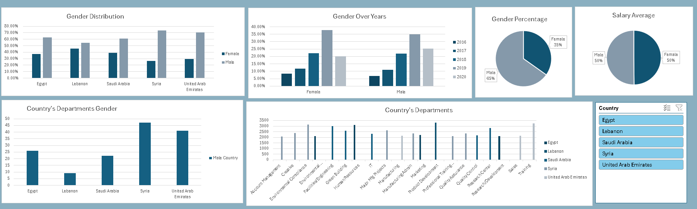
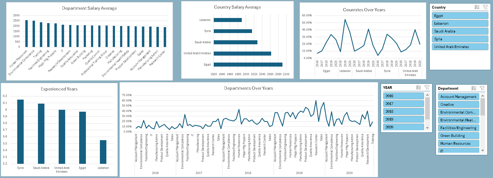

# 💼 Employee Data Analysis Project

This project focuses on analyzing employee-related data using **Microsoft SQL Server** and visualizing insights with **Excel dashboards**.

---
## 📊 Dataset Overview

The dataset contains the following columns:

- No (Employee ID)
- Firstname / Lastname
- Gender
- Start Date
- Years of Experience
- Department
- Country
- Center
- Monthly Salary
- Annual Salary
- Job Rate
- Sick Leaves
- Unpaid Leaves
- Overtime Hours

---
## 🧠 Key Business Questions Answered

1. **Gender Distribution:**
   - What is the percentage of female employees compared to male employees overall?
   - What is the gender distribution in each country?
   - Which countries employ more females than males?

2. **Salary Analysis:**
   - What is the impact of gender on monthly salary?
   - What is the average salary for each department?
   - What is the average salary in each country?
   - In which country does each department have the highest average salary?

3. **Department & Hiring Trends:**
   - Which departments attract more female employees?
   - Which departments attract more male employees?
   - What is the percentage of employees in each department over the years?
   - What is the hiring percentage in each country over the years?
   - What is the hiring percentage of males and females over the years?

4. **Experience:**
   - What is the average years of experience for employees in each country?

---
## 🛠️ Tools Used

- **SQL Server:** Data exploration, transformation, and aggregation.
- **Excel:** Dashboards and visual representation (using charts, slicers, filters).

---
## 📂 Files in this Repository

- `queries.sql` – Contains all SQL queries used in the employee data analysis.
- `gender_dashboard.png` – Dashboard showing gender distribution, representation by country, and gender-based hiring trends.
- `salary_dashboard.png` – Dashboard showing salary insights, department-wise averages, and hiring over time.

---
## 📸 Dashboard Preview

### 👩‍💼 Gender & Workforce Insights

---

### 💰 Salary & Hiring Trends

---
## ✅ Summary

This project demonstrates how to use SQL for real-world HR data analysis and build clean, focused dashboards in Excel for stakeholder communication.

Feel free to explore the dashboards or reuse the SQL queries for your own analysis.

---
📬 **Created by:** Badr Harmy
🕒 **Date:** July 2025
